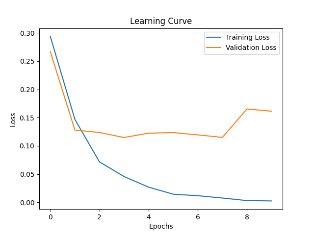
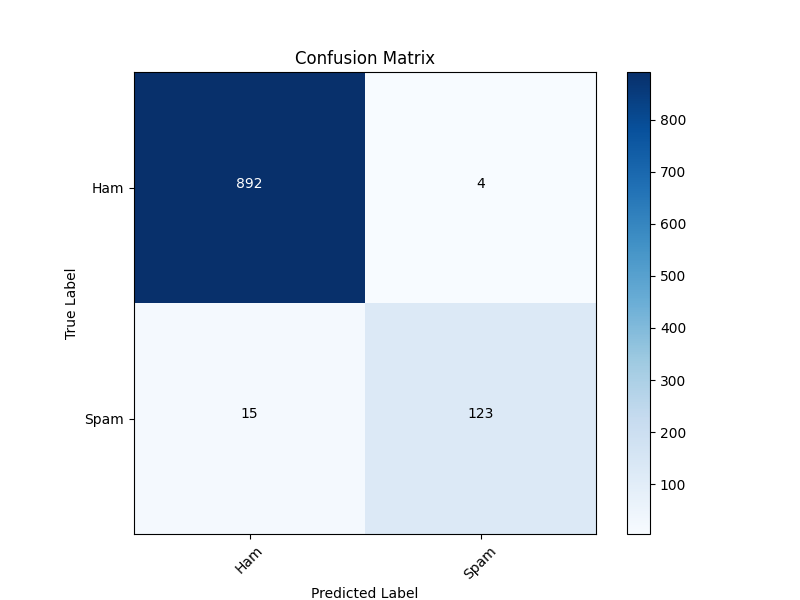
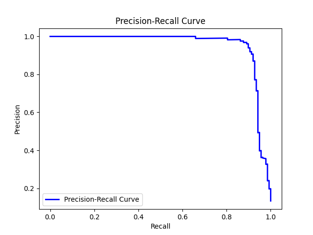
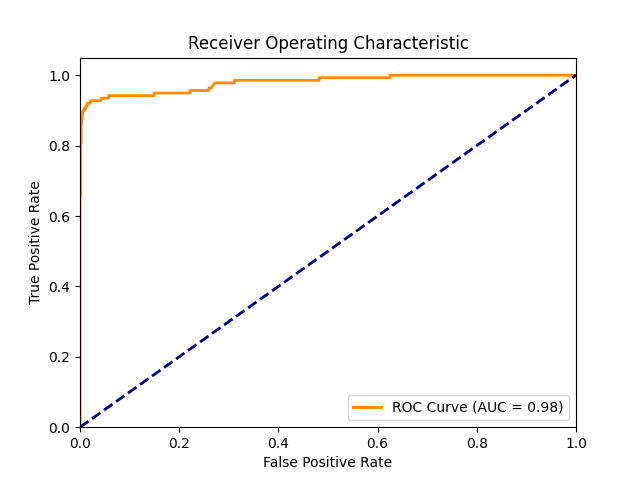

# Spam Email Detection using BiLSTM and Web Deployment

[](https://www.python.org/)
[](https://www.tensorflow.org/)
[](https://flask.palletsprojects.com/en/2.x/)

**Bachelor Thesis Project: Developing a robust spam email detection system using a Bidirectional LSTM (BiLSTM) model and deploying it as a web application with Flask.** This project explores advanced Natural Language Processing (NLP) techniques for classifying text messages and emails as spam or not spam, culminating in a practical web interface for real-time spam detection.

---

## 🎯 Project Overview

### **Objective**

The primary objective of this bachelor thesis is to design, implement, and evaluate a spam email detection system. This involves:

1.  **Building a robust text classification model:** Utilizing a Bidirectional LSTM (BiLSTM) network in TensorFlow/Keras to effectively learn patterns in text data for accurate spam detection.
2.  **Comprehensive Model Evaluation:** Thoroughly evaluating the model's performance using various metrics including Accuracy, Precision, Recall, F1-Score, ROC Curve, AUC, and Confusion Matrix.
3.  **Web Application Deployment:** Creating a user-friendly web application using Flask to deploy the trained model, enabling users to interact with the spam detection system through a web interface.

### **Key Tasks**

1.  **Data Preprocessing and Feature Engineering:**
    *   Loading and cleaning the SMS Spam Collection dataset.
    *   Implementing text preprocessing steps including:
        *   Lowercasing.
        *   Tokenization.
        *   Removal of digits and special characters.
        *   Stop word removal (English).
        *   Lemmatization using WordNetLemmatizer.
        *   Stemming using Porter Stemmer.
    *   Tokenizing text data and padding sequences for consistent input to the neural network.

2.  **BiLSTM Model Development and Training:**
    *   Designing a Bidirectional LSTM (BiLSTM) model architecture using TensorFlow/Keras.
    *   Training the BiLSTM model on the preprocessed SMS Spam Collection dataset.
    *   Saving the trained model and tokenizer for deployment.
    *   Monitoring training progress and optimizing model parameters.

3.  **Model Evaluation and Visualization:**
    *   Evaluating the trained BiLSTM model on a test dataset.
    *   Generating comprehensive evaluation metrics:
        *   Accuracy.
        *   Classification Report (Precision, Recall, F1-Score).
        *   Confusion Matrix (visualized as a heatmap).
        *   Learning Curve (Training Loss vs. Validation Loss).
        *   ROC Curve and AUC Score.
        *   Precision-Recall Curve and Average Precision Score.
    *   Saving evaluation metrics and visualizations for analysis and reporting.

4.  **Flask Web Application Development and Deployment:**
    *   Developing a Flask web application to serve as the user interface for the spam detection system.
    *   Creating web routes for:
        *   Homepage.
        *   Text Spam Detection: Allows users to input text and get real-time spam probability and classification.
        *   Email Spam Detection: Allows users to connect to their Gmail inbox (user-authenticated) and classify the first 30 emails in their inbox as spam or not spam.
    *   Integrating the trained BiLSTM model into the Flask application for real-time predictions.

---

## 🛠️ Tools & Technologies

*   **Core Libraries:** Python, Pandas, NumPy, NLTK
*   **Machine Learning Framework:** TensorFlow/Keras (for BiLSTM model)
*   **Web Framework:** Flask (for web application)
*   **Evaluation Metrics:** Scikit-learn (for metrics, confusion matrix, ROC/PR curves)
*   **Data Visualization:** Matplotlib, Seaborn
*   **Email Handling:** `imaplib`, `email` (for email integration)
*   **Serialization:** `pickle` (for saving tokenizer and training history)

---

## 📊 Model Performance

The model performance is evaluated using various metrics and visualizations, demonstrating its effectiveness in spam detection. Key evaluation graphs and metrics are generated using `graph_gen.py` and include:

*   **Learning Curve:**

    

*   **Confusion Matrix:**

    

*   **Precision-Recall Curve:**

    

*   **Receiver Operating Characteristic (ROC) Curve:**

    

*   **AUC Score (ROC Curve):**  `0.98` (as shown in the ROC Curve image)
*   **Average Precision Score:** (Refer to the output of `graph_gen.py` execution)
*   **Accuracy on Test Set:** `0.98` (as reported in the `trainer.py` output)

**Classification Report:**

| Metric        | Ham   | Spam  |
|---------------|-------|-------|
| **Precision** | 0.98  | 0.96  |
| **Recall**    | 0.99  | 0.90  |
| **F1-Score**  | 0.99  | 0.93  |
| **Support**   | 896   | 138   |
| **Accuracy**  |       | 0.98  |
| **Macro Avg** | 0.97  |       |
| **Weighted Avg**| 0.98  |       |

---

## ⚙️ Setup and Run

1.  **Clone the repository:**
    ```bash
    git clone https://github.com/RaduBalaita/Bachelor-Thesis
    cd Bachelor-Thesis
    ```

2.  **Install required Python libraries:**
    ```bash
    pip install -r requirements.txt
    ```

3.  **Run the Flask web application:**
    ```bash
    python app.py
    ```

4.  **Access the application:** Open your web browser and go to `http://127.0.0.1:5000/` or the address provided in the console output.

5.  **To retrain the model or regenerate evaluation graphs:**
    *   Run `python trainer.py` to retrain the BiLSTM model and save it.
    *   Run `python graph_gen.py` to generate updated evaluation graphs in the `RNN-Results/` directory.

### Alternately, you can use docker:
```bash
docker pull radubalaita/spam-detection-app
```
---

## 📚 Key Learnings

1.  **BiLSTM for Text Classification:** Deep understanding of implementing and training Bidirectional LSTM networks for effective text classification tasks like spam detection.
2.  **NLP Preprocessing Techniques:** Mastery of essential NLP preprocessing techniques including tokenization, stop word removal, lemmatization, and stemming for cleaning and preparing text data.
3.  **Model Evaluation & Metrics:** Proficient in evaluating machine learning models using a wide range of metrics and visualizations, interpreting results, and understanding model performance.
4.  **Web Deployment with Flask:** Practical experience in deploying machine learning models as interactive web applications using the Flask framework, creating user interfaces, and handling user inputs.
5.  **End-to-End ML Project Development:** Comprehensive experience in the full lifecycle of a machine learning project, from data loading and preprocessing to model development, evaluation, and deployment.
